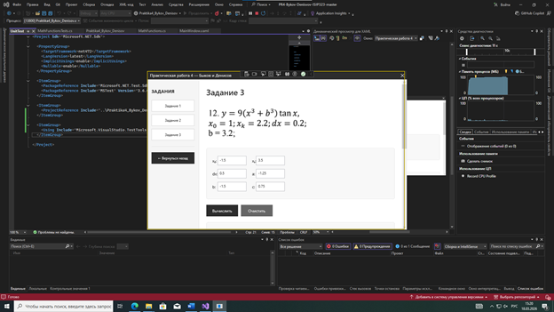
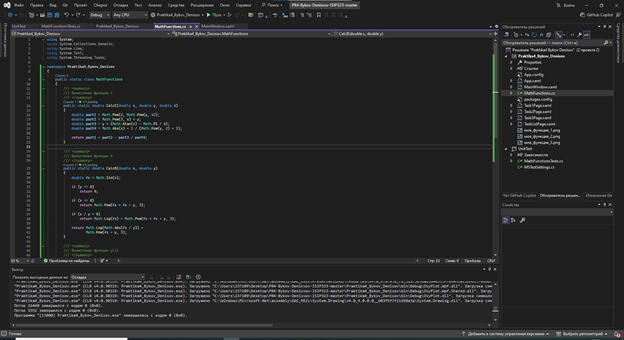
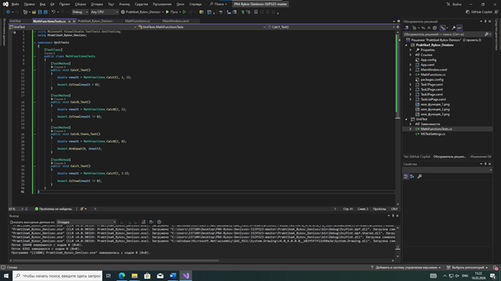

# Практическая работа №6.2: Тестирование методом "белого ящика"

**Дисциплина:** Поддержка и тестирование программного обеспечения  
**Студенты:** Быков Денис, Денисов Никита  
**Группа:** 3ИСИП-323  
**Преподаватель:** Аксенова Т.Г.

---

**Цель работы:** Провести тестирование математических программных модулей методом "белого ящика" с использованием средств автоматизации Microsoft Visual Studio.

---

## 🔧 Рефакторинг кода

Исходный код содержал вычисления непосредственно в основном файле программы. Для обеспечения возможности модульного тестирования был выполнен рефакторинг — математические функции были вынесены в отдельный класс **MathFunctions**.

### Созданные методы

| Метод | Назначение |
|-------|------------|
| `CalcC()` | Вычисление первой математической функции |
| `CalcB()` | Вычисление кусочной функции |
| `CalcY()` | Вычисление функции табуляции |

Структура решения:

---

## 🧪 Разработка unit‑тестов

В рамках работы были разработаны автоматизированные тесты для проверки корректности работы математических функций. Тестирование проводилось методом «белого ящика», что позволило проверить внутреннюю логику методов.

### Разработанные тесты

| № | Название теста | Тип | Проверяемый сценарий | Ожидаемый результат |
|---|----------------|-----|----------------------|---------------------|
| 1 | `CalcC_Test` | ✅ Позитивный | Проверка вычисления функции C | Корректное значение |
| 2 | `CalcB_Test` | ✅ Позитивный | Проверка функции B | Корректный результат |
| 3 | `CalcB_Yzero_Test` | ❌ Негативный | Проверка при y = 0 | Возврат 0 |
| 4 | `CalcY_Test` | ✅ Позитивный | Проверка функции Y | Корректное значение |

Код unit‑тестов:

---

## 📊 Результаты тестирования

### Обозреватель тестов (Test Explorer)

**Итог:** Все тесты успешно пройдены ✅

---

## 🐛 Исправленные проблемы

### Проблема: BadImageFormatException

При первоначальном запуске тестов возникла ошибка несовместимости форматов сборки.

**Причина:**
Разные настройки Target Framework и Output Type у основного проекта и проекта тестов.

**Решение:**
- Проекты приведены к одной версии .NET
- Основной проект переведен в тип Class Library
- Выполнена пересборка решения

После исправления тесты начали выполняться корректно.

---

## 📈 Вывод

### Достигнутые результаты

1. **Рефакторинг кода**
   - Математические функции вынесены в отдельный класс
   - Добавлены XML‑комментарии
   - Улучшена структура программы

2. **Разработка тестов**
   - Созданы автоматизированные unit‑тесты
   - Проверены основные сценарии работы функций
   - Проверены граничные условия

3. **Тестирование**
   - Все тесты выполнены успешно
   - Подтверждена корректность работы функций
   - Проверена обработка исключительных ситуаций

---

## 🛠 Используемые технологии

- **.NET 8.0** – платформа разработки
- **C#** – язык программирования
- **MSTest** – фреймворк модульного тестирования
- **Visual Studio 2022** – среда разработки
