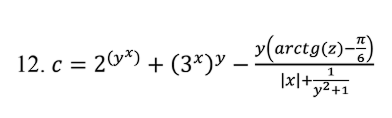
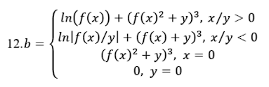
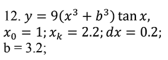

# Практическая работа №4 Часть 1: Тестирование "белым ящиком"

## Общая информация

| | |
|---|---|
| **Дисциплина** | Поддержка и тестирование программных модулей |
| **Название работы** | Практическая работа №4: Тестирование "белым ящиком" |
| **Цель работы** | Приобретение практических навыков ручного тестирования методом "белого ящика" |
| **Вариант** | №12|

## Разработчики

| Студент | Группа |
|---------|--------|
| Быков Денис | 3ИСИП323 |
| Денисов Никита | 3ИСИП323 |

## Задание

Разработать WPF-приложение с тремя страницами для вычисления математических функций:

### Страница 1: Расчет функции t

**Функция:**
t = (2cos(x-π/6))/(0.5+sin²y) * (1 + z²/(3-z²/5))
**Скриншот функции:**

### Страница 2: Расчет функции с переключателями

**Функция:**
a = { (f(x) + y)² - √(f(x)·y), xy > 0
{ (f(x) + y)² + √|f(x)·y|, xy < 0
{ (f(x) + y)² + 1, xy = 0
**Скриншот функции:**

### Страница 3: Циклические вычисления с графиком

**Функция:**
y = (10⁻²·b·c)/x + cos(√(a³·x))
**Скриншот функции:**

## Стек технологий

| Технология | Назначение |
|------------|------------|
| **C#** | Язык программирования |
| **Visual Studio 2022** | Среда разработки |
| **XAML** | Язык разметки интерфейса |
| **OxyPlot.Wpf** | Библиотека для построения графиков |

## Архитектура приложения

### Структура проекта

Praktika4_Bykov_Denisov/
│
├── App.xaml # Точка входа приложения
├── MainWindow.xaml # Главное окно с навигацией
├── MainWindow.xaml.cs # Логика главного окна
│
├── TaskListPage.xaml # Страница со списком заданий
├── TaskListPage.xaml.cs
│
├── Task1Page.xaml # Страница задания 1
├── Task1Page.xaml.cs # Логика вычислений для задания 1
│
├── Task2Page.xaml # Страница задания 2
├── Task2Page.xaml.cs # Логика вычислений для задания 2
│
├── Task3Page.xaml # Страница задания 3
├── Task3Page.xaml.cs # Логика циклических вычислений и графика

## Ссылка на репозиторий

[GITHUB](https://github.com/DEONIGI197/PR4-Bykov-Denisvov-ISIP323)

